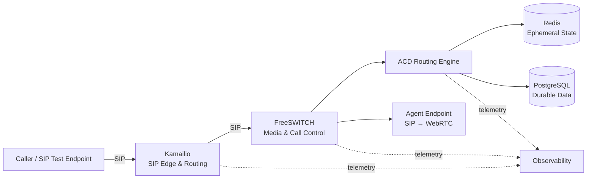

# Carrier-Grade Mini ACD

> A production-oriented lab for building an Automatic Call Distributor with Kamailio, FreeSWITCH, and modern distributed-systems patterns.

## Why this project exists

A basic queue demo is easy. A resilient voice platform is not. This project progressively builds an ACD while exposing the engineering decisions behind SIP signaling, RTP/media, call state, routing, failure handling, scaling, observability, and agent connectivity.

The objective is a **runnable engineering lab**, not a claim that the initial milestones are production-ready.

## Target architecture



## Milestone 1 — Local SIP ACD

The first working milestone deliberately keeps the architecture small:

```text
Caller → Kamailio → FreeSWITCH → Queue → SIP Agent
```

Goals:

- Run the voice stack locally with Docker Compose.
- Route SIP signaling through Kamailio.
- Send ACD traffic from Kamailio to FreeSWITCH.
- Register/test two SIP agent endpoints.
- Queue a caller and deliver the call to an available agent.
- Capture and explain the SIP ladder.
- Verify bidirectional RTP.
- Document failure behavior rather than hiding it.

## Roadmap

| Milestone | Capability |
|---|---|
| M1 | Local SIP ACD: Kamailio + FreeSWITCH + SIP agents |
| M2 | External routing engine and explicit agent/queue state |
| M3 | Redis-backed ephemeral state and PostgreSQL durable data |
| M4 | WebRTC agent endpoint |
| M5 | Metrics, logs, SIP tracing, Prometheus/Grafana |
| M6 | Failure injection, health-aware routing and recovery |
| M7 | Horizontal scaling and HA patterns |
| M8 | Multi-carrier ingress and routing policies |

## Repository layout

```text
.
├── docker-compose.yml
├── kamailio/
├── freeswitch/
├── routing-engine/
├── agent-ui/
├── database/
├── monitoring/
├── scripts/
├── tests/
└── docs/
```

Directories are introduced as the corresponding milestone becomes executable; we avoid empty architecture theater.

## Engineering questions

This lab is designed to make questions visible that toy ACD implementations often skip:

- Which component owns dialog, queue, and agent state?
- What happens to an established call if Kamailio fails?
- What happens when a FreeSWITCH node disappears before or during media handling?
- How are signaling and media scaled independently?
- How do we avoid stale agent state?
- How should retries work without causing duplicate call delivery?
- How do we trace one call across SIP, media, routing, and application events?
- Which state must survive a process, node, or region failure?

## Security scope

The local lab starts on an isolated development network. Later milestones will explicitly address SIP authentication, topology hiding, TLS/SRTP, network policy, secret management, rate limiting, abuse controls, and production hardening.

**Do not expose the development configuration directly to the public Internet.**

## Status

🚧 **Under active development — M1 bootstrap**

The next commit establishes the local Docker network, Kamailio SIP edge, FreeSWITCH service, and baseline configuration required for the first end-to-end call.

## License

A license will be selected before the project is presented as reusable software. Until then, no license is granted merely by publication of the source.
