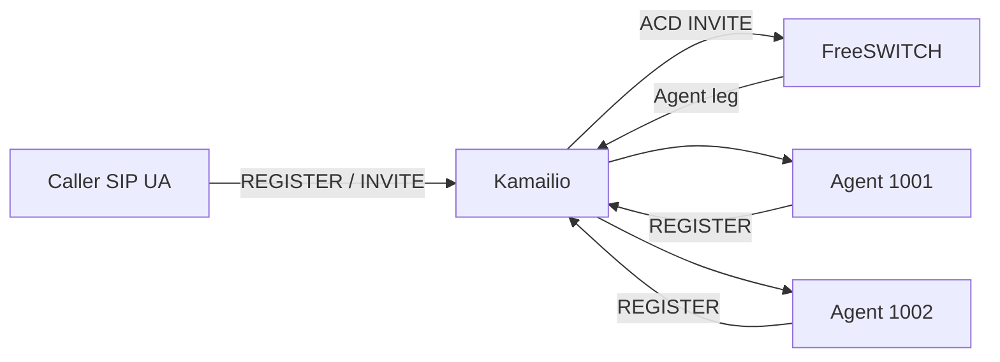

# Architecture

## Design principle

The project separates the **signaling edge**, **media/call-control plane**, and eventually the **ACD decision/state plane**. M1 intentionally collapses some ACD behavior into FreeSWITCH so that we first establish a measurable end-to-end voice path before introducing distributed state.

## M1 logical topology

### Kamailio

Responsibilities in M1:

- SIP edge for caller and agent endpoints.
- REGISTER processing/location service for lab endpoints.
- Route the configured ACD destination to FreeSWITCH.
- Route FreeSWITCH-created agent legs toward registered endpoints.
- Remain outside the RTP path.

### FreeSWITCH

Responsibilities in M1:

- Receive calls for the ACD destination.
- Own media processing for the queued call.
- Provide the initial queue/agent-delivery behavior.
- Generate the outbound agent call leg.

### SIP endpoints

Two generic SIP user agents represent agents. This keeps M1 independent of a browser/WebRTC implementation. WebRTC is introduced only after signaling, routing, queueing and RTP are proven.

## State ownership evolution

M1 is intentionally not the final state model.

| State | M1 | Target |
|---|---|---|
| SIP registration | Kamailio | Kamailio/location layer |
| SIP dialog | SIP endpoints / FreeSWITCH | same, with HA-aware routing |
| Media session | FreeSWITCH | FreeSWITCH/media tier |
| Queue membership | FreeSWITCH | ACD service + explicit state model |
| Agent availability | FreeSWITCH/simple lab config | Routing service + Redis/event state |
| Durable interaction data | minimal logs | PostgreSQL/event pipeline |

## Failure domains to test

Later exercises will deliberately test:

1. Kamailio restart while a call is established.
2. FreeSWITCH failure before answer.
3. FreeSWITCH failure after answer.
4. Agent endpoint disappears with a stale registration.
5. Routing/state service timeout.
6. Redis unavailable or partitioned.
7. Database unavailable while real-time routing remains healthy.
8. Carrier path failure and alternate ingress.

Each scenario will document expected behavior, observed behavior, evidence, and remediation.
