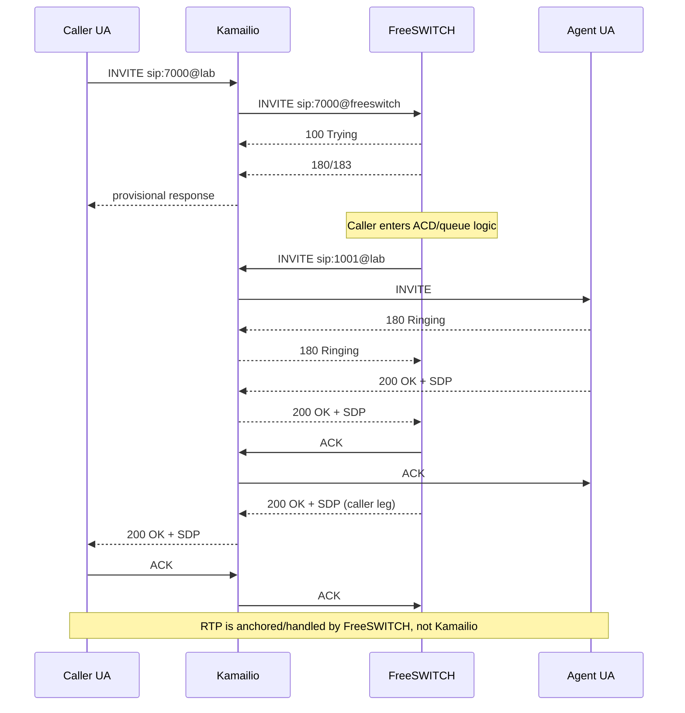

# Call Flows

## M1 target call flow

The initial ACD number is represented as `7000`; agents are `1001` and `1002`. These identifiers are lab defaults and will later move to environment/configuration data.

## What to inspect

For every milestone we will capture:

- Call-ID and dialog identifiers.
- Via, Record-Route and Contact behavior.
- SDP offer/answer addresses and codecs.
- INVITE retransmissions and response timing.
- Which component generates each call leg.
- RTP source/destination addresses and negotiated payload types.
- BYE direction and teardown behavior.

The goal is to correlate the logical ACD behavior with the actual wire protocol rather than treating SIP as a black box.
